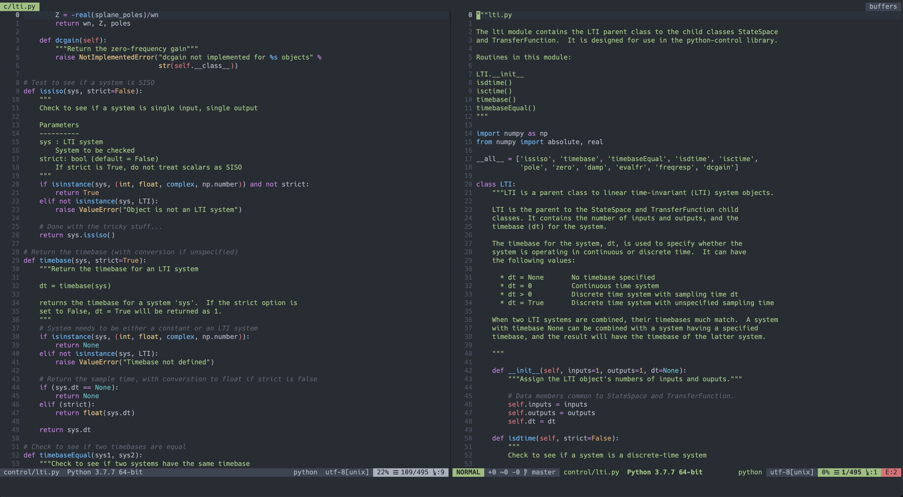
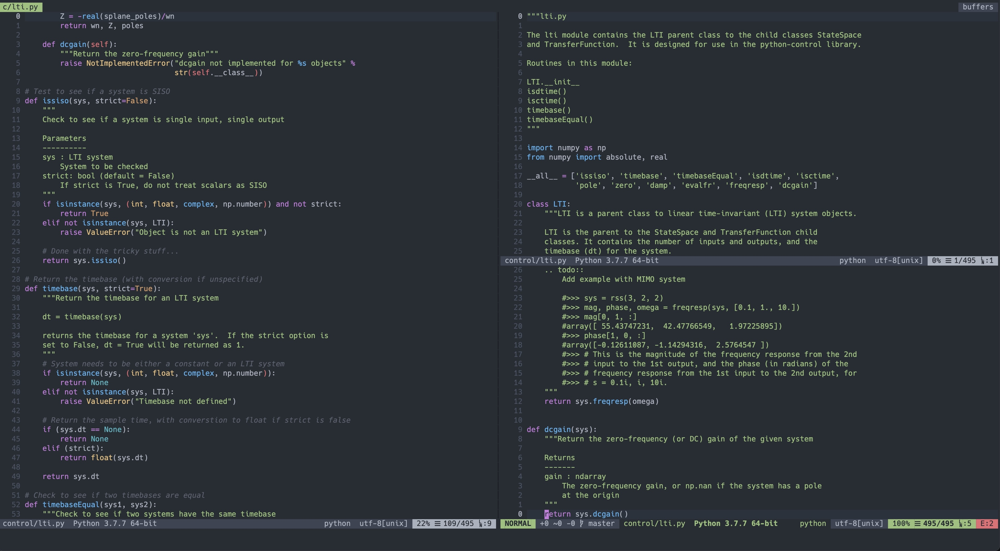

# A modern, multi-purpose neovim configuration for academics on a Mac

- modular: add and configure plugins in separate files, then source them to a central init.vim file

- multi-purpose: use it for writing in science and engineering with markdown, pandoc, and LaTeX, or for coding in python

- one build, diverse realizations everywhere: enjoy consistent performance in the commandline, in a packaged GUI such as [vimR](https://github.com/qvacua/vimr), or in [VS Code](https://github.com/asvetliakov/vscode-neovim)!

- modern-looking:

  

  

  

# Setup

- install [neovim](https://neovim.io)
- install related apps (some functions will be unavailable in absence of these accessories):
  + [fzf](https://github.com/junegunn/fzf): fuzzy finder
  + [ripgrep](https://github.com/BurntSushi/ripgrep): search enhanced
  + [fd](https://github.com/sharkdp/fd): faster find
  + [coc](https://github.com/neoclide/coc.nvim/wiki/Install-coc.nvim): language server and text editing support
  + [ranger](https://github.com/ranger/ranger): vim-like file management and navigation
  + a LaTeX distribution such as [MacTeX](https://www.tug.org/mactex/) and [TinyTeX](https://yihui.name/tinytex/)
- clone this folder to a convenient location on your computer, e.g.,
  \~/Downloads/nvim
- backup your original nvim settings, e.g., in commandline with
  ```{.shell}
  mv ~/.config/nvim ~/.config/nvim-bk
  ```
- move this folder to your vim setting folder, e.g.,
  ```{.shell}
  mv ~/Downloads/nvim ~/.config/nvim
  ```
- To sync setting on multiple computers, store the folder in a network
  drive and symbolically link the folder to your vim setting folder.

# todo

- feature explanations

# References

- [NVCode](https://github.com/ChristianChiarulli/nvim): motivated the modularized setup, a few of the initial settings, and the use of the onedark theme.
